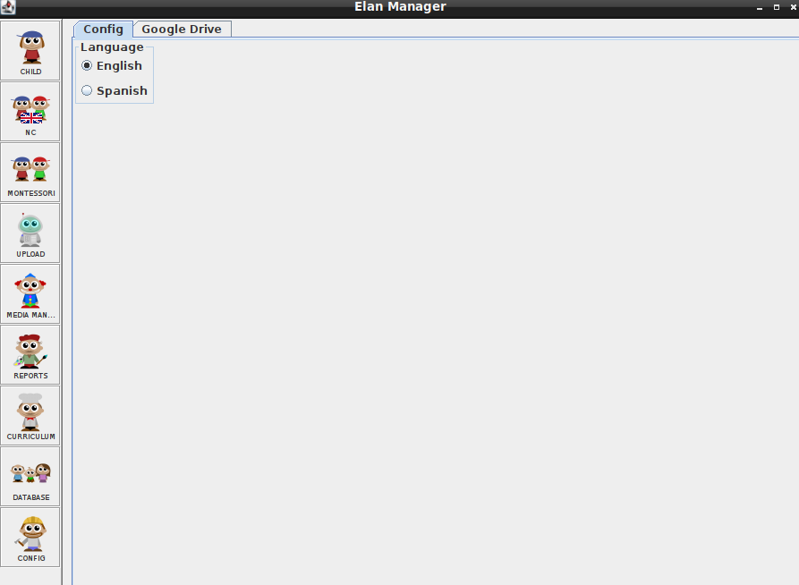
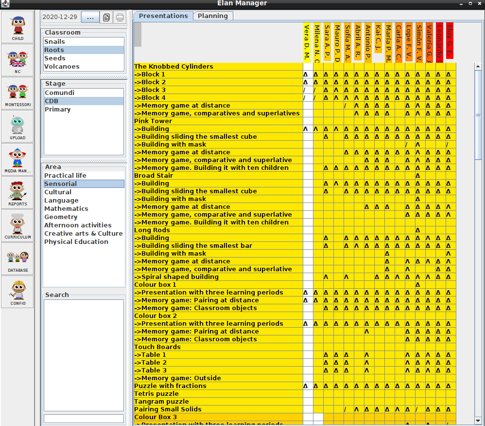

# Java Programming

## PROJECT: APPLICATION TO MANAGE A MONTESSORI BRITISH SCHOOL

## Introduction

It is an application to manage a Montessori British School.
It manages the evolution of the children in the curriculum, and the reporting to the parents.

## To install and run

- Clone the project repo from [GitHub](https://github.com/Zappat0n/elan_manager) using `git clone https://github.com/Zappat0n/elan_manager/`.
- Make sure [Java](https://openjdk.java.net/) is installed.
- Create a MariaDb or MySql database using the file database_creation.sql for the structure.
- (Optional) Set up a Google Drive account if you want to upload pictures with evidences of the children progress.
- Set up a Settings.ini file with the information needed to connect to the database.
- (Optional) Include the information needed in the Settings.ini file to configure the automatic updates of the application from a server.
- (Optional) Include the information needed in the Settings.ini file to configure the email server to send emails to the parents.
- Compile the application using main/ApplicationLoader.java as the main Class.
- Launch the compiled application.

## Features

These are the current implemented features:

- Management of the students and the classroom
- Management of the British curriculum
- Management of the Montessori Curriculum
- Upload of pictures with evidences to Google Drive
- Generation of quarter and year reports with the progress of the children
- Email of the reports to the parents.

Pending features:

- Link of Montessori presentations with the British curriculum
- Improve database management
- Improve reports

## Designed With
- Java
- Git
- GitFlow
- Rubocop
- VS Code

## Contribute to this Project

Contributions, issues, and feature requests are welcome! Start by:

- Forking the project
- Cloning the project to your local machine
- cd into the project directory
- Run git checkout -b your-branch-name
- Make your contributions
- Push your branch up to your forked repository
- Open a Pull Request with a detailed description of the development branch of the original project for a review

## Authors

👤 **Angel Barros**

- GitHub: [@Zappat0n](https://github.com/Zappat0n)
- LinkedIn: [LinkedIn](https://www.linkedin.com/in/angel-barros/)

## Show your support

Give a ⭐️ if you like this project!
